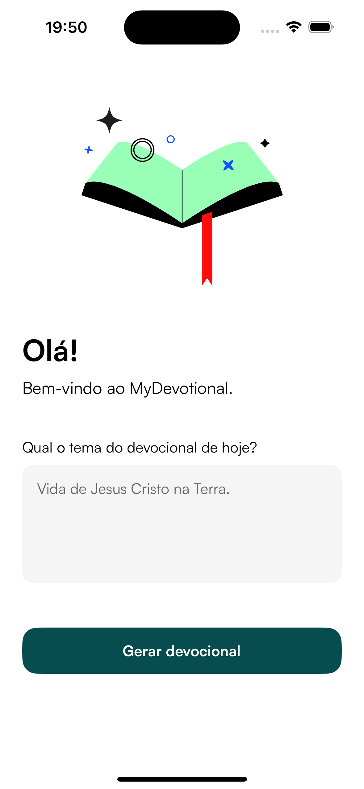
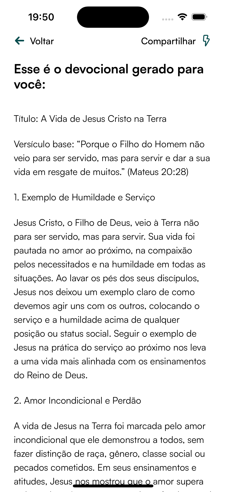

# My Devotional

## Introduction
Welcome to the MyDevotional, an application designed to provide you with personalized daily devotionals based on inspiring themes. Strengthen your faith and spirituality with our curated content, tailored to your unique preferences.

## Screenshots
Below are a couple of screenshots showcasing the app's interface:

 

## How to Run the Project Locally

### Prerequisites
Ensure you have the following installed on your machine:
- Node.js (v14.x or later)
- npm (v6.x or later) or yarn (v1.x or later)
- Android Studio or Xcode (for Android or iOS development)

### Installation

1. Clone the repository:
   ```bash
   git clone https://github.com/GersonRocha9/MyDevotional.git
   cd MyDevotional

2. Install dependencies:
   ```bash
    npm install
    # or
    yarn install

3. Set up the environment variables:
Create a .env file in the root of the project and add necessary environment variables. Refer to .env.example for the required variables.

We need just a OpenAI Key.

### Running the app

1. Run the app:
   ```bash
    npx expo start -c

### Technology Stack
The MyDevotional is built using the following technologies:

- **React Native**: For building cross-platform mobile applications.
- **TypeScript**: For type-safe JavaScript code.
- **Expo**: A framework and platform for universal React applications, making development and deployment simpler.
- **React Navigation**: For navigation and routing within the app.
- **Lottie**: For rendering animations from Adobe After Effects, enhancing the user experience with smooth and visually appealing animations.
- **Restyle**: A library for building design systems and styling React Native apps in a type-safe way.

